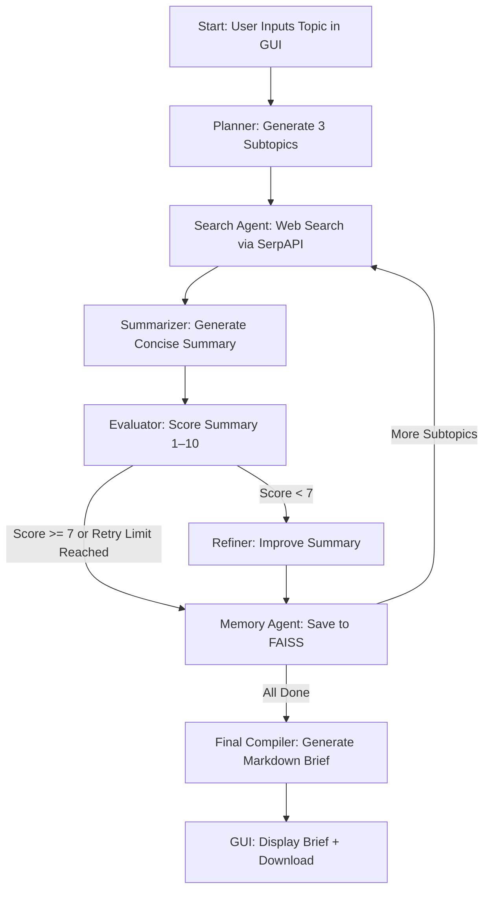

# 🧠 AI-Powered Research Assistant with Streamlit GUI

This project is an AI-driven research assistant that automates the creation of structured research briefs on any topic. It leverages LangGraph for workflow orchestration, LangChain for LLM integrations, and a Streamlit GUI for a user-friendly interface. Powered by LLaMA 3 (via Groq API) and SerpAPI, it:

- Accepts a user-input topic through a sleek web interface.
- Splits the topic into three concise subtopics.
- Performs web searches for each subtopic.
- Summarizes, evaluates, and refines the results.
- Stores summaries in a FAISS vector database.
- Compiles a Markdown-formatted research brief, displayed in the GUI with a download option.

The Streamlit GUI enhances usability with real-time progress updates, a progress bar, and a modern design with light/dark theme support.

## 🔧 Technologies Used

- **Streamlit**: Interactive web-based GUI for user input and output display.
- **LangGraph**: Workflow orchestration for stateful agents.
- **LangChain + LangChain Community**: Integrations and utilities for LLMs and tools.
- **Groq API**: Fast inference using LLaMA 3 models.
- **SerpAPI**: Real-time web search results.
- **FAISS**: Vector database to store and retrieve summaries.
- **HuggingFace Embeddings**: For generating vector representations of text.
- **Dotenv**: For managing API keys securely.

## ⚙️ Project Workflow



## 🚀 How It Works

- **User  Input**: Enter a research topic in the Streamlit GUI (e.g., "Quantum sensors in agriculture").
- **Subtopic Generation**: The LLM splits the topic into three concise subtopics.
- **Web Search**: SerpAPI fetches relevant web results for each subtopic.
- **Summarization**: The LLM summarizes results into five lines.
- **Evaluation**: The LLM scores the summary (1–10).
- **Refinement**: If the score is < 7 and the retry limit (3) isn’t reached, the summary is improved.
- **Memory (FAISS)**: Summaries are stored in a vector database.
- **Loop**: Repeats for all subtopics (max 3).
- **Output**: A Markdown-formatted research brief is displayed in the GUI, saved to `research_brief.md`, and available for download.

The GUI provides real-time feedback with a progress bar and styled status messages in a modern green and blue theme.

## 📁 File Structure

```
├── research_assistance.py      # Core pipeline code (LangGraph workflow)
├── research_assistant_gui.py   # Streamlit GUI
├── .env                        # API keys for Groq and SerpAPI (not committed)
├── requirements.txt            # Python dependencies
└── README.md                   # This file
```

## ✅ Example Output

# Research Brief: Quantum Sensors in Agriculture

### Subtopic 1: Precision Mapping with Quantum Sensors
Quantum magnetometers enhance detection of soil anomalies and water tables...

### Subtopic 2: Crop Monitoring
Quantum devices improve accuracy in measuring plant stress and predicting yield...

### Subtopic 3: Agricultural Optimization
Real-time data from quantum devices enables optimized resource allocation...

This is displayed in the Streamlit app and saved as `research_brief.md`.

## 📦 Setup Instructions

### Clone the Repository:
```bash
git clone https://github.com/your-username/ai-research-assistant.git
cd ai-research-assistant
```

### Install Dependencies:
Create a virtual environment (optional) and install required packages:
```bash
python -m venv venv
source venv/bin/activate  # On Windows: venv\Scripts\activate
pip install -r requirements.txt
```

### Create a .env File:
Copy `.env.example` to `.env` and add your API keys:
```
GROQ_API_KEY=your_grok_key
SERPAPI_API_KEY=your_serpapi_key
```
Obtain keys from Grok and SerpAPI.

### Run the GUI:
```bash
streamlit run research_assistant_gui.py
```
This opens a browser at `http://localhost:8501`.

### Use the GUI:
- Enter a topic (e.g., "Artificial intelligence in education").
- Click "🚀 Generate Research Brief".
- Monitor progress via the progress bar and status messages.
- View the brief, download it, or check `research_brief.md`.

## 🧪 Sample Questions to Test

- Applications of AI in education
- Quantum sensors in healthcare
- Innovations in sustainable packaging
- Blockchain in supply chain management

## 🎨 GUI Features

- **Modern Design**: Green (#4CAF50) and blue (#2c3e50) theme with hover effects and rounded buttons.
- **Real-Time Feedback**: Progress bar and styled status boxes with emojis (e.g., 📌, 🔍).
- **Output**: Markdown-rendered brief with a download button.

## 🛠️ Troubleshooting

- **API Errors**: Verify `GROQ_API_KEY` and `SERPAPI_API_KEY` in `.env`.
```
